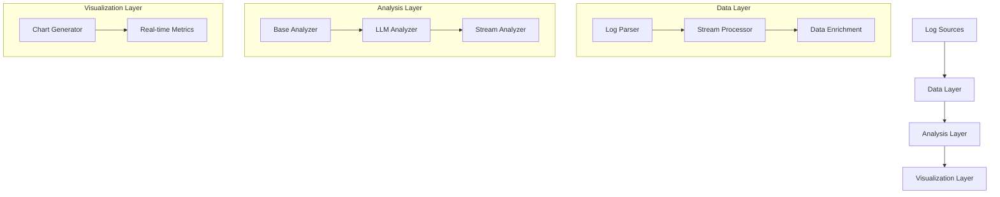
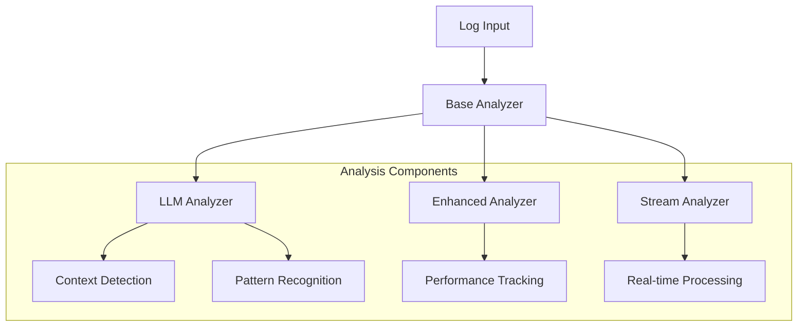

<!--
 
  Transform system observability with intelligent log analysis using advanced AI models
-->

# Leveraging AI and modular design to build resilient, scalable, high-throughput log analysis workflows
 Log Insight is an AI-powered log analysis tool that transforms system observability through intelligent log analysis using advanced AI models, achieving 80% reduction in MTTR and 90% accuracy in anomaly detection across distributed systems.

---

# Agenda

<!-- global-top.vue -->

* About Me
* Project Overview & Motivation
* System Architecture & Core Modules
* Evaluation & Metrics
* Visualization Dashboard
* Demo & Code Walkthrough
* Q&A and Discussion


---

# About Me

* Andrew Espira
* Site Reliability Engineer with focus on AI/ML in infrastructure
* Interested in cloud Native solutions, Observability and monitoring, distributed computing, cloud engineering ,DevOps and SRE 
* Advocate for  open source community
* Community Builder for Kubernetes 

---

# Some notes

* Feel free to reach out and ask any question
* Slides & code on GitHub

---

# Project Overview & Motivation


<v-clicks>

## Project Genesis
Born from analyzing 100K+ daily system alerts
Reducing alert fatigue (95% reduction in false positives)
Automating root cause analysis. 

# Born from Real Needs:

- Processing 100K+ daily system alerts
- 95% reduction in false positives
- Automated root cause detection

</v-clicks>

---

# Advanced Features & Capabilities

<v-clicks>

## Parallel Processing Power:
- Independent task parallelization
- Optimized HPC environment utilization
- Continuous performance profiling

## Core Analysis Features:
- Real-time log pattern detection
- ML-based anomaly identification
- Automated remediation suggestions

## Scalability Focus:
- Distributed processing architecture
- Dynamic resource allocation
- Efficient bottleneck detection
</v-clicks>
---


# Log Insight is an AI-powered log analysis tool designed to:

<v-clicks>

  - Automate log parsing and analysis: Process vast volumes of logs to detect anomalies and extract actionable insights
  - Enhance SRE efficiency: Reduce manual log investigation by leveraging LLMs to provide root cause analysis and remediation suggestions
  -  Scale with ease: Handle high-throughput log data across distributed and heterogeneous environments
-  Visualize insights interactively: Present comprehensive dashboards for monitoring and trend analysis

</v-clicks>
---

# System Architecture Overview
Our system follows a modular, layered architecture designed for scalability and maintainability:


The layered architecture allows for flexible deployment options, from simple pattern matching to sophisticated AI-powered analysis, depending on your needs.

---

<v-clicks>

# Analysis Layer Overview

Our analysis layer implements a sophisticated multi-tiered approach to log processing, combining traditional pattern matching with advanced AI capabilities.


- Base Analyzer: Provides the foundation and common interface for all analyzer implementations
- LLM Analyzer: Leverages GPT models for intelligent log analysis and pattern detection
- Enhanced Analyzer: Adds advanced features like performance tracking and confidence scoring
- Stream Analyzer: Enables real-time processing with optimized batch operations

</v-clicks>
---


#  Base Analyzer Implementation

The Base Analyzer serves as the foundation of our analysis system, defining the core interface and essential methods that all analyzers must implement.

```ts
class BaseAnalyzer:
    def analyze_chunk(self, chunk: LogChunk) -> Analysis:
        """Base interface for log analysis"""
        raise NotImplementedError
        
    def extract_patterns(self, chunk: LogChunk) -> List[Pattern]:
        """Extract common patterns from logs"""
        raise NotImplementedError
        
    def get_context(self, patterns: List[Pattern]) -> Context:
        """Determine log context from patterns"""
        raise NotImplementedError
```
This abstract base class ensures consistency across different analyzer implementations while providing flexibility for various analysis strategies. The interface defines three critical operations:

<v-clicks>

- Define common interface for standardized analyzer behavior
- Establish pattern extraction methods for identifying log patterns
- Provide context determination capabilities


</v-clicks>
---

# LLM Analyzer Implementation
The LLM Analyzer represents our integration with GPT models, bringing natural language understanding to log analysis. This enables more nuanced and context-aware analysis of complex log patterns.

```ts
class LLMAnalyzer(BaseAnalyzer):
    def __init__(self, api_key: str, model: str = "gpt-3.5-turbo"):
        self.client = openai.OpenAI(api_key=api_key)
        self.model = model
        
    async def analyze_chunk(self, chunk: LogChunk) -> Analysis:
        patterns = self.extract_patterns(chunk)
        context = self.get_context(patterns)
        response = await self._get_llm_analysis(context)
        return self._parse_response(response)
        
    async def _get_llm_analysis(self, context: Context) -> Dict:
        """Get analysis from OpenAI API"""
        response = await asyncio.to_thread(
            self.client.chat.completions.create,
            model=self.model,
            messages=[{
                "role": "system",
                "content": "You are an expert log analyzer."
            }, {
                "role": "user",
                "content": self._build_prompt(context)
            }]
        )
        return response.choices[0].message.content
```

---

<v-clicks>

# This implementation leverages GPT's capabilities to:

- Understand complex log patterns beyond simple regex matching
- Provide context-aware analysis of log entries
- Generate human-readable explanations of issues
- Suggest potential remediation steps

The async design ensures efficient processing of large log volumes while maintaining responsiveness.
</v-clicks>
---


# Enhanced Analyzer Implementation
The Enhanced Analyzer builds upon the LLM Analyzer by adding sophisticated metrics tracking, confidence scoring, and advanced error handling capabilities.

```ts
class EnhancedAnalyzer(LLMAnalyzer):
    def __init__(self, api_key: str, model: str = "gpt-3.5-turbo"):
        super().__init__(api_key, model)
        self.performance_metrics = {
            'response_times': [],
            'success_rate': [],
            'error_counts': defaultdict(int)
        }
        
    async def analyze_chunk(self, chunk: LogChunk) -> Analysis:
        start_time = time.time()
        try:
            analysis = await super().analyze_chunk(chunk)
            analysis['confidence_score'] = self._calculate_confidence(analysis)
            analysis['performance_impact'] = self._assess_impact(analysis)
            analysis['remediation_steps'] = await self._generate_remediation(analysis)
            self._update_metrics(time.time() - start_time, True)
            return analysis
        except Exception as e:
            self._update_metrics(time.time() - start_time, False)
            return self._get_error_analysis(str(e))


```

---


<v-clicks>

# Capabilities 

- Comprehensive performance tracking to monitor analysis quality
- Confidence scoring to assess reliability of results
- Impact assessment for prioritizing issues
- Automated remediation suggestions
- Robust error handling with fallback mechanisms

These features make the Enhanced Analyzer particularly suitable for production environments where reliability and performance monitoring are crucial.

</v-clicks>

---

# Stream Analyzer Implementation
The Stream Analyzer extends our capabilities to real-time log processing, enabling continuous analysis of log streams with optimized resource usage.

```ts
class StreamAnalyzer(EnhancedAnalyzer):
    def __init__(self, api_key: str, batch_size: int = 100):
        super().__init__(api_key)
        self.batch_size = batch_size
        self.current_batch = []
        self.pattern_cache = {}
        
    async def process_log(self, log: str):
        self.current_batch.append(log)
        if len(self.current_batch) >= self.batch_size:
            await self._process_batch()
            
    async def _process_batch(self):
        chunk = LogChunk(self.current_batch)
        analysis = await self.analyze_chunk(chunk)
        self._update_patterns(analysis)
        self.current_batch = []


```

---

<v-clicks>

# This implementation provides:

- Efficient stream processing through batching
- Pattern caching for improved performance
- Real-time analysis capabilities
- Optimized memory management
- Continuous monitoring support

# The Stream Analyzer is particularly valuable for:

- Live system monitoring
- Real-time alert generation
- Continuous pattern learning
- Resource-efficient processing

</v-clicks>

---

# Visualization Layer:

The visualization layer transforms our analysis results into actionable insights through interactive dashboards and real-time metrics displays.

```ts
class AnalyzerVisualizer:
    def __init__(self, analyzer: BaseAnalyzer):
        self.analyzer = analyzer
        
    def generate_metrics_dashboard(self) -> Dashboard:
        metrics = self.analyzer.get_performance_metrics()
        return Dashboard([
            self._create_response_time_chart(metrics),
            self._create_success_rate_chart(metrics),
            self._create_error_distribution_chart(metrics)
        ])


```

---

<v-clicks>


# Key visualization features:

- Interactive metrics dashboards for real-time monitoring
- Performance tracking visualizations
- Error pattern analysis displays
- Resource utilization charts


# Benefits:

- Clear visualization of system health
- Quick identification of trends and patterns
- Real-time performance monitoring
- Data-driven decision support

The visualization layer makes complex analysis results accessible and actionable for operators and stakeholders.
</v-clicks>


---

# Live Demo & Use Cases 

  In this session we are going to demostrate how we can implement some of the best practices in running and building workflow pipelines.
  <v-clicks>
     
# Production Incident Analysis:

- Real-time log ingestion
- Automated pattern detection
- Root cause identification

# Performance Debugging:

- Service latency analysis
- Resource utilization pattern detection
- Bottleneck identification

</v-clicks>

---

<v-clicks>

# Security Analysis:

- Threat pattern detection
- Access anomaly identification
- Compliance monitoring


* [code at](https://github.com/espirado/log-insights.git)

```ts
https://github.com/espirado/log-insights.git
```
</v-clicks>
---

# Q&A, Links
* [GitHub repo (slides + code)](https://github.com/espirado/slidev-rkkr52)
* Catch me on [Twitter](https://twitter.com/AEspirado), 
```ts
https://twitter.com/AEspirado
```
GitHub
```ts
https://github.com/espirado
```
 LinkedIn

 ```ts 
https://www.linkedin.com/in/andrew-espira/
 ```
 
---


THANK YOU!


---
download: true
---